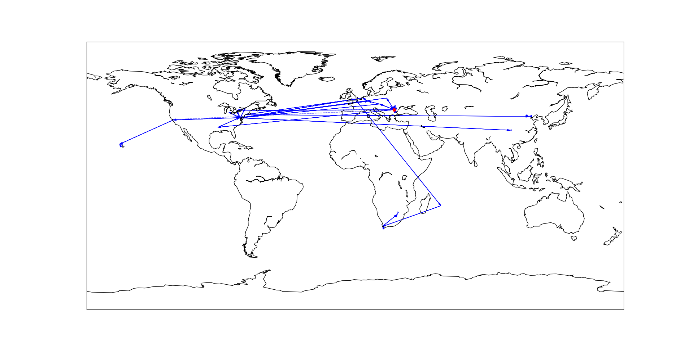
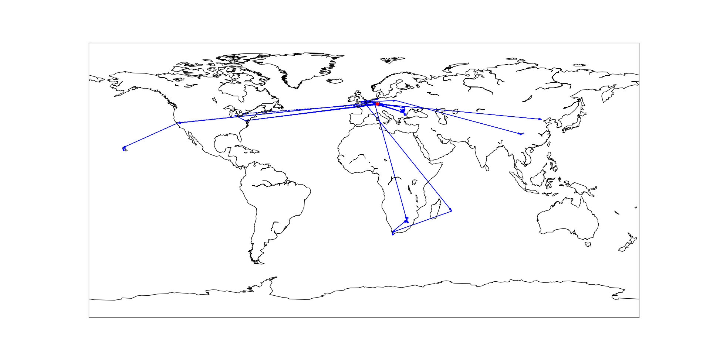

# Traceroute Results

The results are stored in the `src/traceroute_results` directory.
There is a different subdirectory for each network I ran the traceroutes from.

- `home` - my home network with Digi ISP in Bucharest
- `networks_lab_vps` - an Oracle VPS in Frankfurt
- `orange_mobile_data` - my mobile data connection
- `unibuc` - the university network (almost every hop was blocked)

The list of IPs traced from each location is stored in [traceroute_ips.txt](src/traceroute_ips.txt).
The file included the URLs from which the IPs were extracted.

Each hop which was able to be resolved to public IP addresses has the following information (if available):

- Country
- Region
- City
- Coordinates
- ISP
- Organization
- Autonomous System
- Reverse DNS

## Maps

The maps are generated using the [plot_traceroutes.py](src/plot_traceroutes.py) script, which uses `matplotlib.pyplot` with `mpl_toolkits.basemap` to plot the coordinates on a world map.

The dashed and half-transparent lines mean that the final hop did not respond.
This is normal, since most hosts do not send a Port Unreachable or other ICMP message when the UDP traceroute packet reaches the end of the path.

All paths had the coordinates of Bucharest inserted as the starting point, since some paths did not allow any hops in Bucharest to be resolved, so it would look like the path just started in another continent, except for the VPS, which was in Frankfurt.

Here are the maps for each network.

### Home Network

Digi ISP home network in Bucharest.



### Networks Lab VPS (Oracle Cloud Infrastructure, Frankfurt Region)

VPS in Oracle Cloud's Frankfurt region. Traceroutes were run directly from the VPS via SSH, so they do not originate from Bucharest.



### Orange Mobile Data

Traceroutes were ran over a mobile data connection from Orange, using a hotspot. The first private IP address is the gateway phone's IP.


### University of Bucharest

It seems all hops except for one had Time Exceeded messages blocked, so all the traceroutes are just lines from Bucharest to the final hop,
and even those are drawn as dashed lines because the final hops didn't respond.

Since the VPS was configured to respond with Port Unreachable, it indicates ICMP was filtered at the university.

Exactly two IPs were able to respond, from [one trace](traceroute_results\unibuc\193.226.51.38.txt).

```text
6. 1.2.185.1 - Country: "Thailand", Region: "Bangkok", City: "Bangkok", 13.7063, 100.4597, ISP: "TOT Public Company Limited", Organization: "TOT Public Company Limited", Autonomous System: "AS23969 TOT Public Company Limited", Reverse DNS: node-b9d.pool-1-2.dynamic.totinternet.net
7. 193.226.51.1 - Country: "Romania", Region: "București", City: "Bucharest", 44.4299, 26.0632, ISP: "Romanian Education Network", Organization: "", Autonomous System: "AS6693 Universitatea Bucuresti", Reverse DNS: ns1.fmi.unibuc.ro
```


